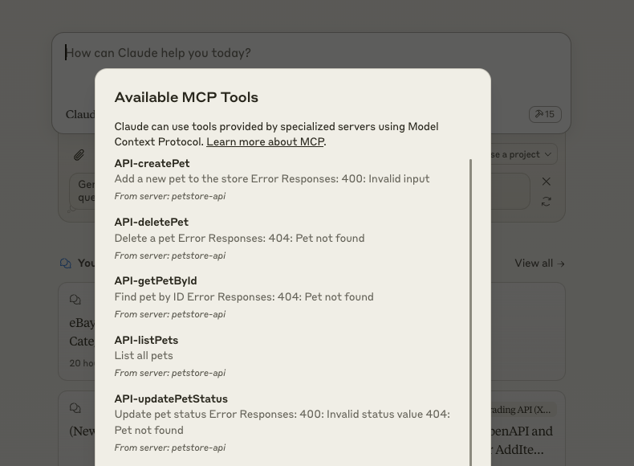

# OpenAPI MCP Server

> **Talk to any OpenAPI (v3.1) compliant API through Claude Desktop!**

This tool creates a [Model Context Protocol (MCP)](https://modelcontextprotocol.io/) server that acts as a proxy for any API that has an OpenAPI v3.1 specification. This allows you to use Claude Desktop to easily interact with both local and remote server APIs.

## What does it do?

This proxy automatically converts OpenAPI endpoints into Claude tools, allowing Claude to:

1. Discover available API endpoints and understand their purpose
2. Know what parameters are required and their types
3. Make API calls on your behalf
4. Handle the responses appropriately

For example, if you have a Petstore API with this endpoint:

```yaml
/pets/{petId}:
  get:
    operationId: getPetById
    summary: Returns a pet by ID
    parameters:
      - name: petId
        in: path
        description: ID of pet to return
        required: true
        schema:
          type: integer
```

Claude will see this as a tool it can use:



You can then ask Claude natural questions like:
- "Can you fetch the details for pet ID 123?"
- "What's the status of my pet with ID 456?"

Claude will understand the context and make the appropriate API calls.

## Getting Started

1. **Configure Claude Desktop:**
   Add this to your `claude_desktop_config.json`:
   ```json
   {
     "mcpServers": {
       "petstore-api": {
         "command": "npx",
         "args": ["openapi-mcp-server", "/abs/path/to/petstore-openapi.json"]
       }
     }
   }
   ```

2. **Restart Claude Desktop** and start interacting with your API!

## Examples

This repository includes a complete example of a Petstore API server that you can use to test the OpenAPI MCP Server. The example server implements a basic CRUD API for managing pets, making it perfect for learning how to use this tool.

See [examples/README.md](examples/README.md) for instructions on running the example server.

## Use Cases

1. **Local Development**
   - Test your APIs through natural conversation
   - Debug endpoints without writing code
   - Explore API capabilities interactively

2. **API Integration**
   - Quickly test third-party APIs
   - Prototype integrations before writing code
   - Learn new APIs through conversation

3. **Documentation**
   - Ask questions about API endpoints
   - Get examples of how to use endpoints
   - Understand error conditions

## Limitations

- Currently supports OpenAPI v3.1 specs only
- Response handling is optimized for JSON/text responses
- File uploads not yet supported
- Streaming responses not yet implemented

## Development

Outstanding tasks are listed in [TODO.md](TODO.md).

Basics:
```bash
# Install dependencies
pnpm install

# Run tests
pnpm test

# Build the project
pnpm build

# Start in development mode
pnpm dev
```

## License

MIT

---

Built with ❤️ for making APIs more accessible through natural language.
